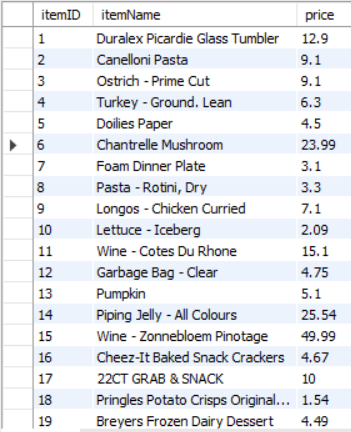
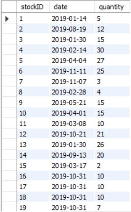
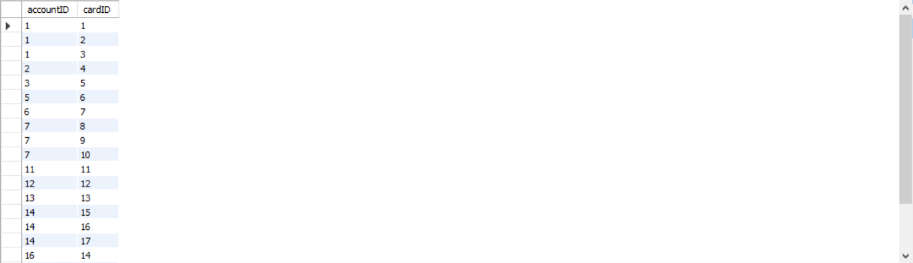

# Project Design Diagram
## CS 157A Team 30
## Aaron Warren, Phu Tran, Evan Ugarte

 

# E/R Diagram Description
## Entity Sets

### Account
- This entity set contains the user's general information such as user's name, address, phone number, password and account ID. The account ID is the primary key for the entity set. This entity set shares 2 relationships with the other entity sets such as a one to many relationship with entity set Card Info and a one to many relationship with entity set Orders.

### Card Info
- This entity set contains the user's card payment information where the primary key is the Card ID. This entity set shares an one to many relationship with the entity set Account.

### Orders
- This entity set represents the user's shopping cart where the primary key will be its order ID attribute. This entity set shares an one to many relationship with the entity set Account

### Item
- This entity holds the relevant information for each item which includes the name, price, category id, and item id. The primary key for each entity is the item ID. The entity set shares a one-to-one relationship with the item stock levels entity set.

### Item Stock Levels
- This entity set has a one to one relationship with the entity set items. This is because as an item can only have one stock level. The entities in the set are identified by the primary key stockID, and are paired to items by the Item's ID.

 

### Item Categories
- This is an entity set that will hold the various categories for Items. The primary key Category ID identifies entities in this set, Category Name is also another attribute. An example of Category name can be "Chips" or "Soda".

## Relationships

### Holds
- This relationship has a one to many relationship between the entity sets Account and Card Info. It is a one to many relationship because each account can holds many different card information as a payment methods. On the other hand, we will assume that each card information can only be store in exactly one account.

### Make
- This relationship has a one to many relationship between the entity sets Account and Orders. It is a one to many relationship because each account can make many orders and each specific order can be make by one account.

### Has
- This relationship has a one-to-one relation between the entity sets Item and Item Stock Levels. It is one-to-one because each item will only have a single stock level to maintain the quantity of each item in the warehouse.
### contain
- This relationship has a one-to-many relation between the entity sets Orders and Item. It is one-to-many because each order can hold many different items. The reason for this is because a person is not restricted to buying only a single item.

### Belongs
- This is a relationship between Item and Item Categories. The relationship is many to many, as Items can have multiple categories and categories have multiple items.
 
 
 
 
 
 
 
 
 
 

# Schemas and Tuples
## Entity Sets -> Relations
### Account(<u>accountID</u>, memberID, email, password)

### CardInfo(<u>cardID</u>, cardHolder, cardNumber, CVV, zipcode)

### Orders(<u>orderID</u>, itemID, memberID, price)

 
 
 
 
 

### Item(<u>itemID</u>, name, price, category)

### Categories(<u>categoryID</u>, categoryName)

### StockLevels(<u>stockID</u>, itemID, stockDate, quantity)

 
 
 
 
 
 
 
 
 
 
 
 
 

## Relationships -> Relations
### Holds(<u>accountID</u>, <u>cardID</u>)

### Make(<u>accountID</u>, <u>orderID</u>)

### Contain(<u>orderID</u>, <u>itemID</u>)

 
 
 
 
 
 
 
 
 
 

### Has(<u>itemID</u>, <u>stockID</u>)

### Belongs(<u>itemID</u>, <u>categoryID</u>)

 
 
 
 
 
 
 
 
 
 
 
 
 
 
 
 
 
 
 
 
 
 
 
 
 
 
 
 
 
 
 
 
 
 
 
 
 
 
 
 
 
 
 
 
 
