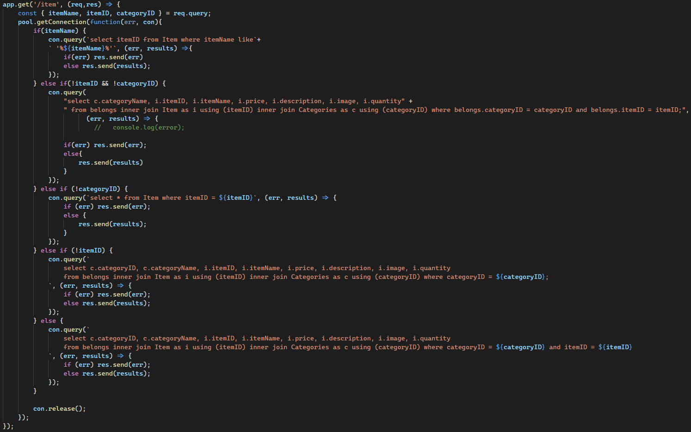
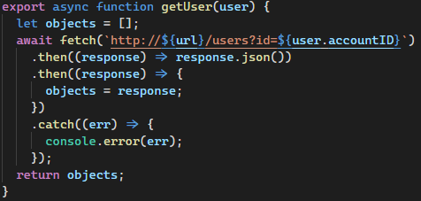
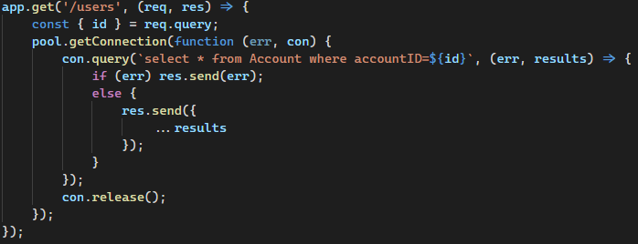
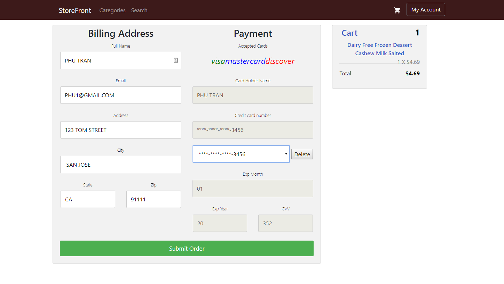

# System Environment

## Hardware, Software used

For our 3-tier project, we made use of Amazon Web Services suite of hardware and software. Our database was run using a MySQL RDBMS and our front and backend is ran using a AWS EC2 Instance running Ubuntu Linux to process requests. The languages that are used in our project include only JavaScript and sql. 

# Functional Requirements

The functional requirements of our project are what anyone would expect from an online marketplace. These include:

- Creating an Account

Creates an account and by taking the input information and giving it to the function `registerUser` shown below

This function then calls a backend function that adds a user to the database shown below

- Login

This feature just logs in a user by checking if a user exists and if it does assigns it a unique sessionID and the accountID. If it is a bad login then nothing is returned. The function called on the frontend is shown below

Which calls on the backend function shown below

- Browse Items

The browsing and selecting items are intertwined together with a single function call on the front and backend. What is returned is based on what is sent. If nothing is sent it will return a list of all the items, if an itemID is sent then it will return only that item, if a categoryID is sent then it will return every item in that category. The frontend functions is shown below

The backend function that is called is shown below

- Search Items

The search function uses the same function as the browse feature for the backend but calls a different frontend function that is shown below

- View Cart

The cart shows what items a user has added to their cart while shopping. The frontend function that is called is shown below

The backend function that is called is shown below

- Selecting and adding items to the cart

The ability to select and add items to the cart is done similarly to how we did orders. The frontend and backend code respectively is shown below

- Deleting items in the cart

Deleting items from the cart is done very easily as it just calls a function and tells it what the itemId and quantity are to delete and sends it to the backend. Both the frontend and backend respectively are shown below

- Adding new payment methods

Adding a new payment method is only able to be done when a user is checking out if they wish to save a payment method. If the box is checked, then the frontend calls a function that adds the card to their account. The code for the front and backend are shown below.

- Deleting payment methods

Deleting a payment method is done easily on the checkout screen as well by simply clicking the delete button. All the happens is that when the delete button is clicked, the UI will reset and a function is called to delete the information from the server. The front and backend code is shown below.

- View account information and email

Viewing a user's account information is done by passing in the current users ID that is stored in a cookie to the backend which returns all the relevant information that is being asked for which includes the email. Front and backend code is shown below.

- View payment methods information

Viewing payment information can only be done on the checkout screen and is done by obtaining all payment methods that are related to the users accountID. The front and backend code is shown below.

- Changing email and password

Changing the email and password can be done on the same screen. A user just has to type in a new email and password as well as confirm their new password and then hit the update button to send it to the server to confirm it. The front and backend code is shown below.

- Purchasing items

Purchasing items requires the user to go through their cart before checking out. This allows us to simply send the information stored in the cart and send it to the orders table to finalize an order. The front and backend code is shown below.

- View order history

Viewing order history shows whatever orders were made in the past as well as the order number, total price, and items ordered. The front and backend code is shown below.

# Implementation

