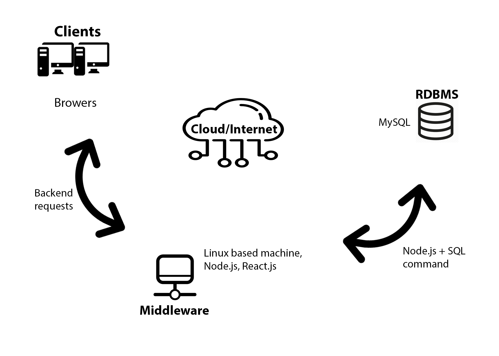
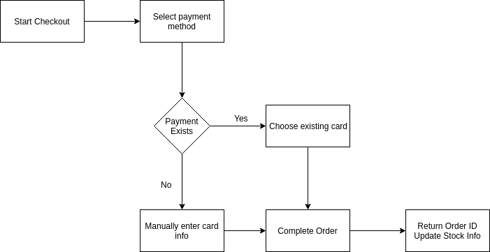
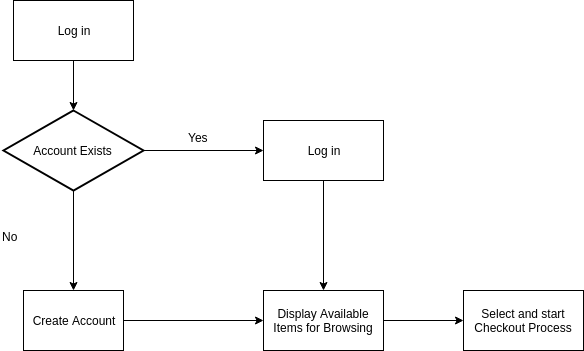

 
 
 
 

<b>

Project Proposal

 

StoreFront
</b>
 
 
 
 
 
 
 
 
 
 
 
 
 
 
 
 
 
 
 

CMPE 157A Team 30

Aaron Warren

Phu Tran

Evan Ugarte

 
 
 
 
 
 
 
 
 
 
 
 
 
 

# Project Overview

For this project, we will be creating a system for customers to order food from a food court. This application would be taking the place of a physical cashier, where users would be able to order food from a web app and pick their order up when it is ready. The application will also be able to manage members, their credit card information, food inventory stock levels and item prices through a database. The stakeholders of this project are company owners who have a kitchen that takes orders, programmers who implement the application, project managers of the project, and store managers. The project is important as a business can use this application to take place of a worker, and instead hire more cooks to handle demand. This project is important as it streamlines the process of ordering food at a business. Customers will be able to clearly select food choices based on photos and descriptions, and pay for their food by credit card.

# System Environment

The design of our system environment includes the use of a Linux based machine to house our database application. This linux server will host an apache webserver that will be serving our application to the users. The database that we will use will be created and maintained by a mySQL DBMS. The front-end application will be written using React.js. The front-end will then communicate with the database through the business logic tier, written in Node.js. Overall, this project will require knowledge of mySQL, Node.js, and React.js to arrive at completion. 

 
 

# Functional Requirements

The users of our system will be anyone who wishes to purchase food from a store. As a result, users are store customers of varying age and gender. Users will be able to access our system from a website, and use a keyboard and mouse to navigate options. Features for the StoreFront application include users being able to make an account, select multiple items to purchase, modify payment information and update their personal account info.

### Functional requirements features will include:
- User will be able to create a new account or sign in using their existing account
- User will be able to browse, select, or delete the items that they want to purchase
- User will be able to select, add, or modify their payment methods
- User will be able to update their account

## Processes Diagrams

### Checking Out

 
 
 
 
 
 
 
 
 
 
 
 
 
 

### Logging In

 
 
 
 

# Non-functional Requirements

Non-functional requirements include many things such as performance, scalability, security, endurance, usability, and stability. Our goal for these non-function requirements would be to hit most of these for our final product. For performance, we plan on having our website able to support a large amount of users. For scalability, we are going to try to efficiently manage how we access our database to allow for easy expansion as well as code our front-end in a way where we could easily modify one section without effecting the others. For security, we are planning on working making sure our authentication system works effectively for individual accounts. For usability, users will be able to easily and effectively navigate our website regardless of their personal circumstances. And finally for stability, our website should be able to handle a large amount of users without effecting another users experience. Overall, the website should be easy to use for both users and programmers alike as well as being able to efficiently handle large numbers of users.
