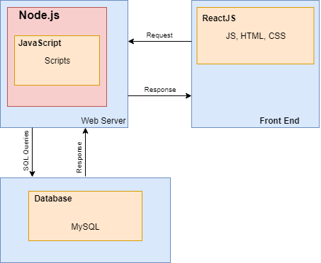

 
 
 
 

<b>

Project Requirements

 

StoreFront
</b>
 
 
 
 
 
 
 
 
 
 
 
 
 
 
 
 
 
 
 

CMPE 157A-01 Team 30

Aaron Warren

Phu Tran

Evan Ugarte

 
 
 
 
 
 
 
 
 
 
 
 
 
 

# Project Description
The goal of this project is to create a food ordering system for customers at a food court. The motivation of this project is to help streamline the process for customers to order food. The process of food ordering will be sped up as customers will be able to clearly select what they wish to order from photos, food names and prices. Stake holders of this project will include the owners and managers of food businesses as they would be using the product to sell food. Additional stakeholders include the programmers who implement the application and project managers of the project. Benefits to users include an improved expereince to order food. This improved experience will come from menus being easier to read with large photos and text being presented on a screen. Additional contributions to the experience will include having existing payment information be stored in the system so the user can checkout faster. In addition to the improved experience, users will likely spend less time in line as the system can reduce the amount of time spend ordering food.

# System Environment

XXXXXXXX

 
 
 
 
 
 
 
 
 
 
 
 
 
 

# Functional Requirements
Our system is designed for customers of all ages and genders. The system is designed to target everyone from those who wish to purchase food from a store to those who just want to merely browse the list of available items. Users can access the website from anywhere, as long as they have access to the internet and an appropriate device such as a desktop computer or mobile phone. There are two types of general users for this StoreFront application: registered and unregistered users. The registered user can enjoy all of the features of the StoreFront application, which includes browsing, selecting multiple items to purchase to add them to shopping cart, save favorite items, modify payment information and update their personal account information.

### Functional Requirements:
- Create account/sign-up
  - Users will be able to create their account by entering their email, password, and additional information such as name. For those who already have an account and try to sign-up for a new one, the website will display a message alerting the user that their email is already in use for an existing account.
  - The system will check if a user's email and username already exists in the database. If email/username wasn't found, the system will write the new email and password to the database and display a message to the users letting them know that they have successfully created an account. If an email exists or is invalid, the system will display an error message to let users know that their account was not able to be created.
- Login/Sign Up
  - Users can login to the webpage by entering their email and password.
  - The system will check to see if the given email and its associated password are the same with the information that are stored in the database. If it is, the system will allow the user to access their account. If it is not, the system will display an error message through the webpage to let the user know if the email or password is incorrect.
- Browse items
  - Users will be able to view all of the items in the database through the StoreFront webpage. Each item will have an associated image, name and price.
  - To display the items to the user, the system will access the item entity set in the database and return all of the values in the table.
- Search items
  - Users will be able to use system's search tab to search for specific items by item fields, such as category or name.
  - After a search is entered, the system will access the database to find all appropriate items. The results of the query will be displayed to the user. If the query returned a total of zero items, then a message will be displayed to let the user know.
- Selecting and adding items in the cart
  - Users can select the items that they are interested in and add them to the cart to purchase later.
  - The system will keep track of current items in the cart for later use and only remove when the user deletes or purchases the item from the shopping cart.
- Deleting items in the cart
  - Users can remove any item that they no longer want from the their shopping cart.
  - The System will access a particular relation in the database and delete the entity of the item(s) that the user specified to remove.
- Add new payment methods
  - Users will be able to add a new credit card as a method payment by entering card number, card type, holder name, CVV (card verification value), and card expiration date.
  - System will check with the database to see if the card number already exist or not. If so, the user will be notified that this payment method already exists. If it does not, store all this information in a secure way in the database
- Delete payment methods
  - User will be able to delete exist payment method of their choice.
  - System will access the database and delete the entity that match the value that the user selected.
- Select payment methods
  - Users can select already existing methods that they have created to check out their order faster.
  - The system will retrieve all payment options of the user and present it to them upon checking out items.
- Editing updating account information
  - Users will be able change their password, username, and payment options through the application UI.
  - The system will access the database and modify the entity inside a particular relation according to the information that is to be changed.

 
 
 
 
 
 
 
 
 
 
 
 
 
 
 
 

# Non-functional Requirements
- Security
  - Users's login information, username and password, as well as their payment method information will not be store directly inside the database. Instead, we will generate a key know as salt (the term use in cybersecurity) and add it to these information and then hash it. We will then use the result of the hashes to store inside the database. By doing this, we can minimize the users' information from leaking out in case the database get hacked or hijacked.
- Access Control
  - Each user will only be able to view their own information which includes email and userID. A user will not be able to see their own password which can only be changed and not read. Each user will have control over only their own information and not be able to view another users info under any circumstance. 
- Performance and Stability
  - The system will be able to handle a large amount of users through various techniques which include usage of balance switches if user counts turn out to be too high. If the system gets too overloaded, then we will design a method to distribute server load across different servers to help balance the load.
- User Interface
  - Our user interface will make use of various techniques that should allow for better usability. This includes not overwhelming a user with too many options, active feedback based on what is being done, as well as ensuring that users have an easy time using our website. On top of this we will ensure that our UI (user interface) is consistent and simple across the board to allow both new and old users an easier time using our website.
